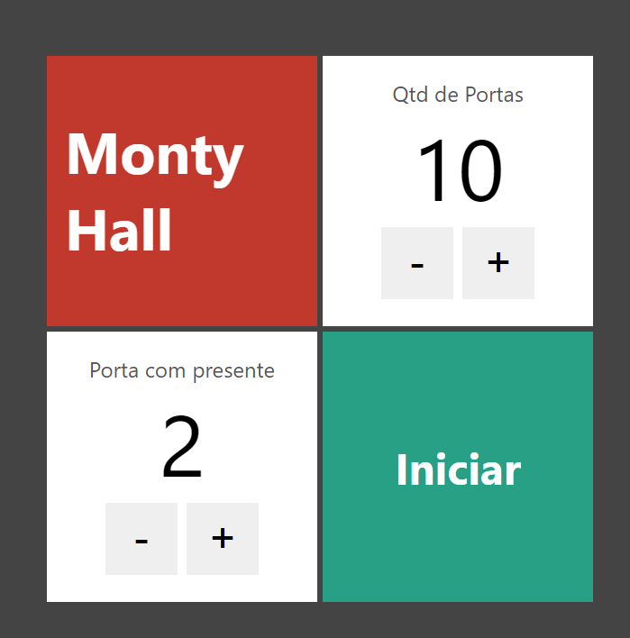
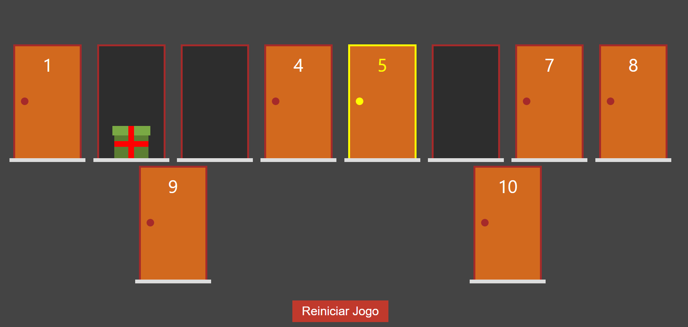

# App Porta da Felicidade (em construção)

Esse aplicativo é um jogo, onde o organizador seleciona uma quantidade de portas e decide em qual porta terá um prêmio.
O participante deverá escolher a porta correta para receber o prêmio.
Pode ser usado para sortear algo também ou até para tomar uma descisão aleatória.

   

# Objetivos

- [ok] Aprender a usar o NextJS;

- [ok] Treinar TypeScript no NextJS;

- [ok] Treinar a criação de models com Typescript e o uso deles no NextJS;

- [ok] Treinar o uso de CSS modules;

- [ok] Treinar o uso de forms controlados;

- [ok] Treinar o uso de props;

- [ok] Treinar o uso de interfaces;

- [ok] Aprender a usar parâmetros passados através da url;

- [ok] Treinar a mudança de estilo CSS através de props.

# Créditos

Ao professor @Leonardo_Moura pela excelente didática no ensino do NextJS e a @Cod3r pelas idéias incríveis de projetos para práticar.

# Link do site

